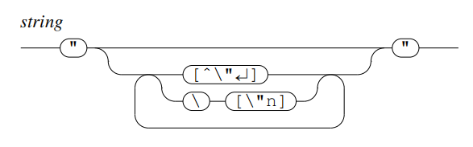

# 词语(Term)

词语(term)是逻辑编程中用来表示参数的最小单元，它可以被分为以下三大类：

1. simpleterm
2. function
3. tuple

.png>)

## Simpleterm

简单词是最常见的词语，它又可被分为以下7种

1. interger 整数
2. constant 常量
3. string 字符串
4. variable 变量
5. \_ 匿名变量
6. \#sup 无穷小
7. \#inf 无穷大

.png>)

### Constant

常量的第一个字母小写，第一个字符允许以下划线开头，之后的字符为大小写字母或者数字或者下划线

 (1).png>)

### String

字符串是一个被双引号囊括的字符序列，它里面出现反斜杠，换行符与双引号时，需要用反斜杠进行转义



### Variable

类似于常量，不过它的首字母为大写

 (1).png>)

## Function

函数可以执行特定的功能，它以常量起首，之后紧跟着一个圆括号，圆括号内部为函数执行的参数，参数的类型也是term，这意味着你可以把其它函数当参数传给另外的函数。

```
try(john, X, another_function(15))
```

在这个例子中，try为函数，它的参数为常量john，变量X，函数another\_function()

.png>)

## Tuple

元组是一系列term的集合，它们直接以逗号为分隔

```
(john, X, another_function(15))
```

元组看起来很像是没有名字的函数，但它们所代表的含义是完全不相同的

元组可以在最后一个元素后面再加一个逗号，以此来标明这是一个元组

```
(t, )
```

这在元组只有一个元素时是必做的，因为像下方的(t)会被当成一个t常量

```
(t)
```

.png>)
